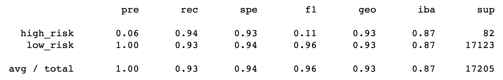

# Credit Risk Analysis

## Overview

The purpose of this analysis is to evaluate various machine learning models' effectiveness at predicting credit risk. The algorithms evaluated are:

- RandomOverSampler
- SMOTE
- ClusterCentroids
- SMOTEENN
- BalancedRandomForestClassifier
- EasyEnsembleClassifier

## Results

The balanced accuracy score for each algorithm is as follows:

- RandomOverSampler: 0.672
- SMOTE: 0.651
- ClusterCentroids: 0.559
- SMOTEENN: 0.653
- BalancedRandomForestClassifier: 0.767
- EasyEnsembleClassifier: 0.934

## Summary

Reducing bias via EasyEnsembleClassifier proved to be most effective in terms of balanced accuracy score, while undersampling via ClusterCentroids was least effective. EasyEnsembleClassifier also performed best according to classifications reports, showing the highest values for precision, recall, and F1 scores.

Although precision for identifying high risk cases is low, it remains higher than the precison of all other evaluated models, which ranged 0.01-0.02.

Because EasyEnsembleClassifier is the most accurate model, it's recommended above the others, though it should be noted that it will erroneously classify many low risk cases as high risk, so it may be worth seeking out a better model.
